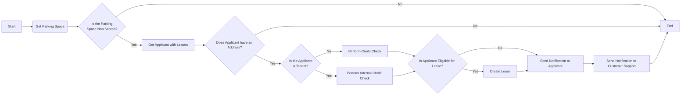
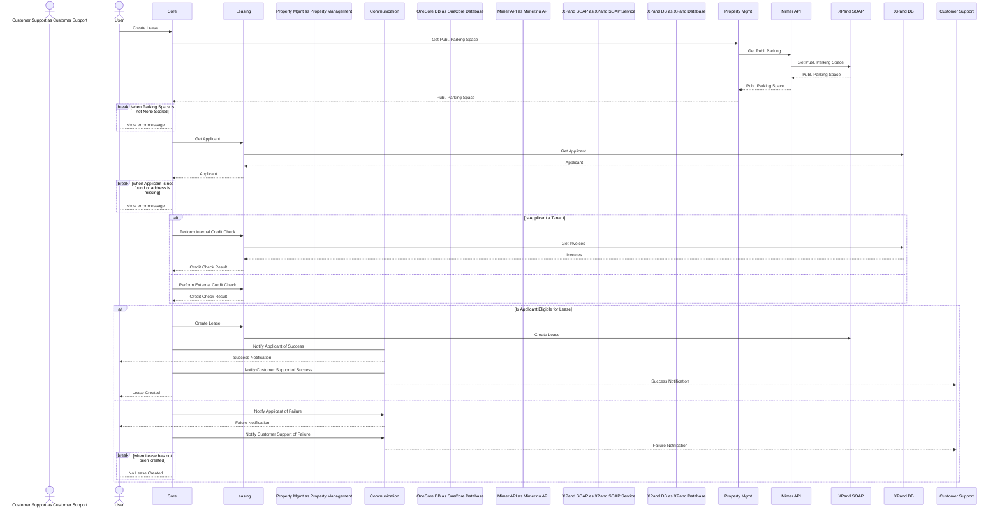

# Create Lease for Non Scored Parking Space

## Flowchart

```mermaid
flowchart LR
A[Start] -->B(Get Parking Space)
B --> C{Is the Parking<br/>Space Non Scored?}
C --> |No| O[End]
C --> |Yes| D[Get Applicant with Leases]
D --> Q{Does Applicant have an Address?}
Q --> |Yes| F{Is the Applicant<br/>a Tenant?}
Q --> |No| O
F --> |No| L[Perform Credit Check]
L --> I
F --> |Yes| H[Perform Internal Credit Check]
H --> I{Is Applicant Eligable for Lease?}
I --> |Yes| J[Create Lease]
I --> |No| M[Send Notification to Applicant]
M --> N[Send Notification to Customer Support]
J --> M
N --> O
```

## Sequence Diagram

```mermaid
sequenceDiagram
    #participant System as System
    actor Customer Support as Customer Support
    actor User as User
    participant Core as Core
    participant Leasing as Leasing
    participant Property Mgmt as Property Management
    participant Communication as Communication
    participant OneCore DB as OneCore Database
    participant Mimer API as Mimer.nu API
    participant XPand SOAP as XPand SOAP Service
    participant XPand DB as XPand Database

    User ->> Core: Create Lease

    Core ->> Property Mgmt: Get Publ. Parking Space
    Property Mgmt ->> Mimer API: Get Publ. Parking
    Mimer API ->> XPand SOAP: Get Publ. Parking Space
    XPand SOAP -->> Mimer API:Publ. Parking Space
    Mimer API -->> Property Mgmt:Publ. Parking Space
    Property Mgmt -->> Core: Publ. Parking Space

    break when Parking Space is not None Scored
        Core-->User: show error message
    end

    Core ->> Leasing: Get Applicant
    Leasing ->> XPand DB: Get Applicant
    XPand DB -->> Leasing:Applicant
    Leasing -->> Core: Applicant

    break when Applicant is not found or address is missing
        Core-->User: show error message
    end

    alt Is Applicant a Tenant
        Core ->> Leasing: Perform Internal Credit Check
        Leasing ->> XPand DB: Get Invoices
        XPand DB -->> Leasing: Invoices
        Leasing -->> Core: Credit Check Result
    else
        Core ->> Leasing: Perform External Credit Check
        Leasing -->> Core: Credit Check Result
    end

    alt Is Applicant Eligible for Lease
        Core ->> Leasing: Create Lease
        Leasing ->> XPand SOAP: Create Lease
        Core -> Communication: Notify Applicant of Success
        Communication -->> User: Success Notification
        Core -> Communication: Notify Customer Support of Success
        Communication -->> Customer Support: Success Notification
        Core -->> User: Lease Created
    else
        Core ->> Communication: Notify Applicant of Failure
        Communication -->> User: Faiure Notification
        Core ->> Communication: Notify Customer Support of Failure
        Communication -->> Customer Support: Failure Notification
        break when Lease has not been created
            Core --> User: No Lease Created
        end
    end

```
