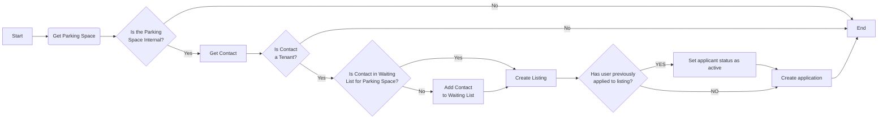

# Create Note of Interest for Internal Parking Space

## Flowchart

```mermaid
flowchart LR
A[Start] -->B(Get Parking Space)
B --> C{Is the Parking<br/>Space Internal?}
C --> |No| X
C --> |Yes| D[Get Contact]
D --> F{Is Contact<br/>a Tenant?}
F --> |No| X[End]
F --> |Yes| H{Is Contact in Waiting<br/>List for Parking Space?}
H --> |No| I[Add Contact<br/>to Waiting List]
H --> |Yes| J
I --> J[Create Listing]
J --> K{Has user previously <br/> applied to listing?}
K --> |YES| O[Set applicant status as active]
O --> G
K --> |NO| G[Create application]
G --> X

```

## Sequence Diagram
