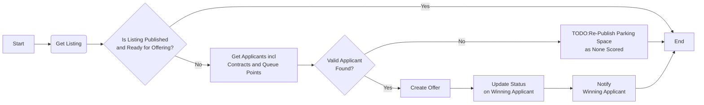
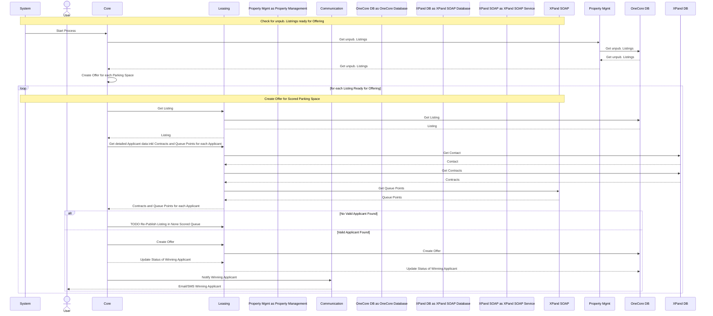

# Create Offer for Scored Parking Space

## Flowchart

```mermaid
flowchart LR
A[Start] -->B(Get Listing)
B --> C{Is Listing Published<br/>and Ready for Offering?}
C --> |Yes| O
C --> |No| D[Get Applicants incl<br/>Contracts and Queue Points]

D --> F{Valid Applicant<br/>Found?}
F --> |No| G[TODO:Re-Publish Parking Space<br/>as None Scored]
G --> O[End]
F --> |Yes| H[Create Offer]
H --> I[Update Status<br/>on Winning Applicant]
I --> J[Notify<br/>Winning Applicant]
J --> O
```

## Sequence Diagram

```mermaid
sequenceDiagram
    participant System as System
    actor User as User
    participant Core as Core
    participant Leasing as Leasing
    participant Property Mgmt as Property Management
    participant Communication as Communication
    participant OneCore DB as OneCore Database
    participant XPand DB as XPand SOAP Database
    participant XPand SOAP as XPand SOAP Service

    Note over System,XPand SOAP: Check for unpub. Listrings ready for Offering
    System ->> Core: Start Process
    Core ->> Property Mgmt: Get unpub. Listings
    Property Mgmt ->> OneCore DB: Get unpub. Listings
    OneCore DB -->> Property Mgmt: Get unpub. Listings
    Property Mgmt -->> Core: Get unpub. Listings
    Core ->> Core: Create Offer for each Parking Space

    loop for each Listing Ready for Offering
        Note over System,XPand SOAP: Create Offer for Scored Parking Space
        Core ->>Leasing: Get Listing
        Leasing ->>OneCore DB: Get Listing
        OneCore DB --> Leasing: Listing
        Leasing -->> Core: Listing
        Core ->> Leasing: Get detailed Applicant data inkl Contracts and Queue Points for each Applicant
        Leasing ->> XPand DB: Get Contact
        XPand DB -->> Leasing:Contact
        Leasing ->> XPand DB: Get Contracts
        XPand DB -->> Leasing:Contracts
        Leasing ->> XPand SOAP: Get Queue Points
        XPand SOAP -->> Leasing: Queue Points
        Leasing -->> Core:Contracts and Queue Points for each Applicant
        alt No Valid Applicant Found
            Core ->>Leasing: TODO Re-Publish Listing in None Scored Queue
        else Valid Applicant Found
            Core ->> Leasing: Create Offer
            Leasing ->> OneCore DB:Create Offer
            Core -->> Leasing: Update Status of Winning Applicant
            Leasing -->> OneCore DB: Update Status of Winning Applicant
            Core ->> Communication: Notify Winning Applicant
            Communication -->> User: Email/SMS Winning Applicant
        end
    end
```
